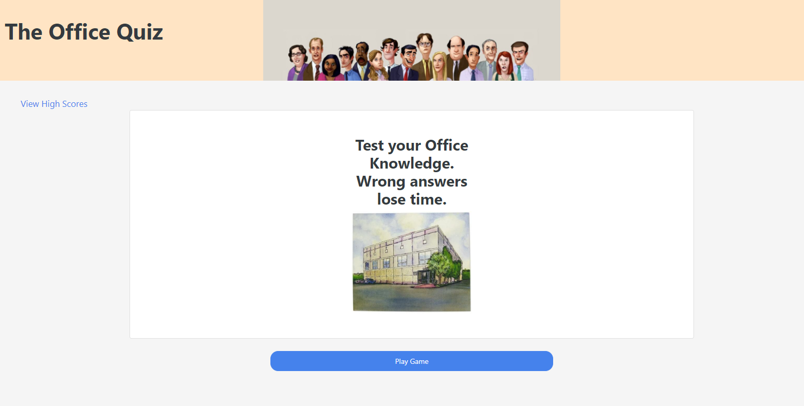

# quiz

This project creates a quiz (based on the TV show 'The Office') that tracks a user's score across 11 questions with a 60 second timer. The timer is reduxed by an additional 5 seconds for every wrong answer. Upon sucessfully completing all of the questions within the time limit, the user is prompted for their name to add to the high score list. The quiz is deployed at:
https://mattmarnien.github.io/quiz/index.html

